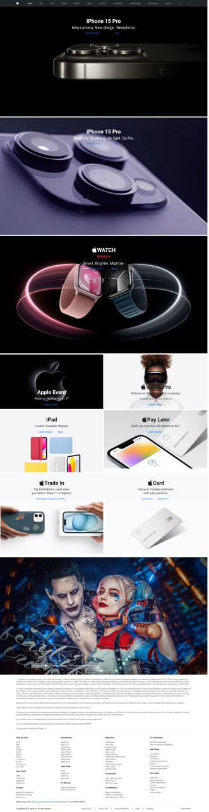

# Apple Home Page clone using bootstrap 5.3.2

This is only using css style in bootstrap with some customization code in style.scss.
The compiler is using the **sass live compiler** extension in VS code.

The output file as follow:

